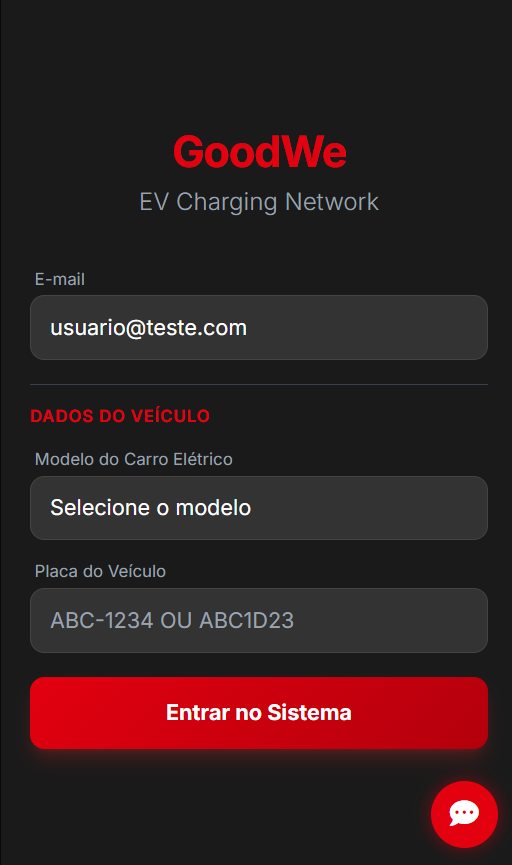
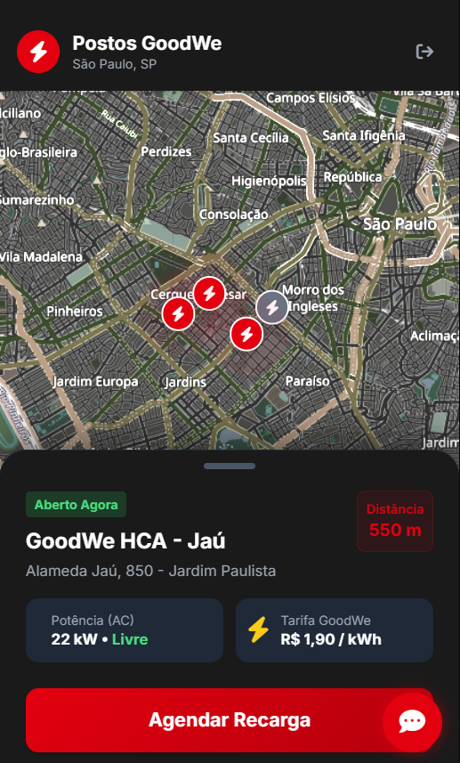
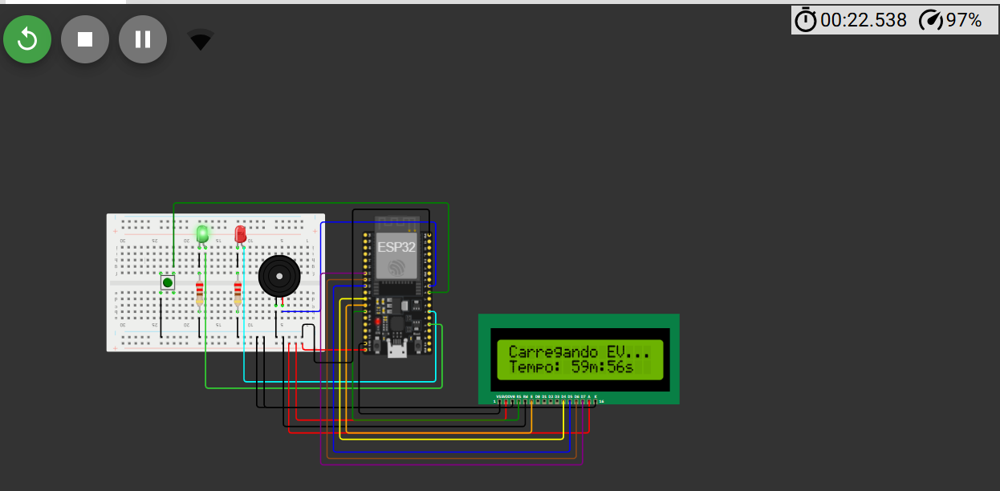

# GoodWe EV Charging Network - FIAP

Plataforma de gestão e agendamento de recarga para veículos elétricos em condomínios e eletropostos, desenvolvida como projeto académico do curso de Ciência da Computação (FIAP) em parceria com a GoodWe. O sistema integra uma interface web, uma API Python, inteligência artificial e simulação de hardware IoT.

## Arquitetura do Projeto

O projeto foi estruturado para simular um ambiente real de recarga, desde a interação do utilizador até à libertação física do equipamento:

* Back-end: Desenvolvido em Python com recurso à framework FastAPI e servidor Uvicorn.
* Base de Dados: Supabase utilizado para persistência de dados de utilizadores e agendamentos.
* Inteligência Artificial: Integração com o Google GenAI SDK (modelo Gemini 2.5 Flash) com System Instructions, atuando como assistente virtual de suporte ao utilizador.
* Hardware / IoT: Simulação de um totem de recarga com um microcontrolador ESP32, integrado através da plataforma Wokwi.
* Front-end: Interface construída com HTML5, JavaScript e TailwindCSS.

## Estrutura do Repositório

* `/backend`: Lógica da API em FastAPI e integração com o modelo generativo.
* `/Simulation` e `/src`: Código em C/C++ do microcontrolador ESP32 e configurações para a plataforma online Wokwi.
* `/docs`: Documentação visual da interface web e estrutura da base de dados.

## Interface do Utilizador

As capturas de ecrã abaixo demonstram o fluxo principal de navegação construído para a aplicação:

| Login e Identificação | Mapeamento de Postos |
| :---: | :---: |
|  |  |

| Agendamento de Recarga | Libertação no Totem |
| :---: | :---: |
|  |  |

## Fluxo de Integração IoT

1. O utilizador realiza o agendamento e simula o pagamento através da interface web.
2. O sistema front-end notifica a API FastAPI sobre a transação.
3. A API regista a operação no Supabase e envia o comando de libertação para o ESP32 a ser simulado no Wokwi.
4. O ESP32 processa o pedido, exibe a confirmação no painel e ativa o botão físico para o início da carga de energia.
